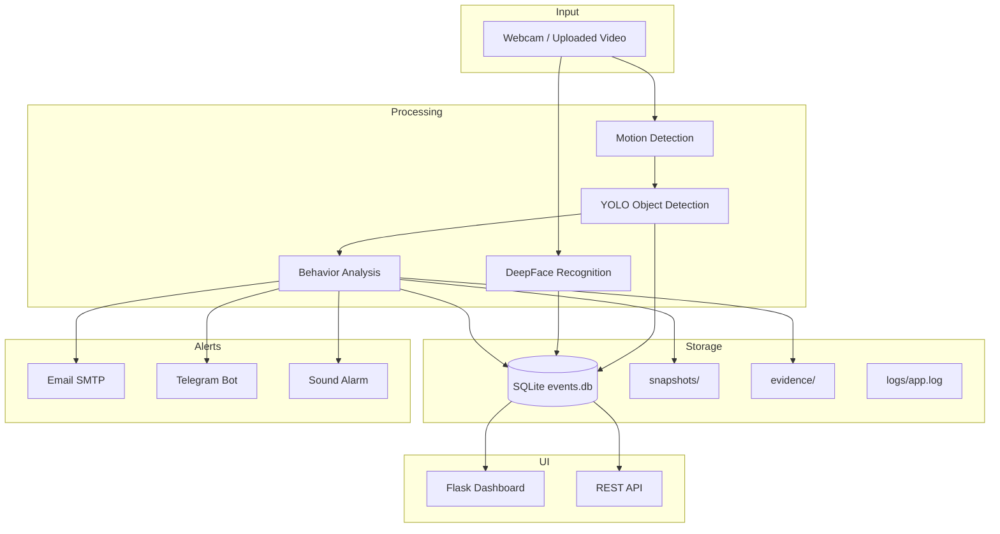

# AI Smart CCTV Surveillance System

A production-oriented AI-powered surveillance platform that combines real-time object detection (YOLO), face recognition (DeepFace), behavior analysis, motion/intrusion detection, and multi-channel alerting (Email, Telegram, sound) with a Flask web dashboard.


> Placeholder — add your own screenshots to `docs/screenshots/`

## Project Overview

This system processes live camera or uploaded video feeds, detects weapons and suspicious objects, recognizes known vs unknown persons, logs every event to SQLite, captures snapshots and 10-second video evidence, and dispatches geotagged alerts with a 60-second cooldown to prevent spam.

## Features

- **YOLO Object Detection** — Weapon/knife detection with bounding boxes and confidence labels
- **Face Recognition** — Auto-loads `known_faces/`; alerts only for unknown persons
- **Behavior Analysis** — Threat classification from detected object classes
- **Motion & Intrusion Detection** — Background subtraction + object correlation
- **Multi-Channel Alerts** — Email (Gmail SMTP), Telegram (text + image), local alarm sound
- **Alert Cooldown** — 60-second deduplication per alert type
- **SQLite Event Database** — Full detection history with GPS coordinates
- **Video Evidence** — 10-second MP4 clips saved on threat detection
- **Snapshot Management** — Timestamped images (`YYYYMMDD_HHMMSS.jpg`)
- **Web Dashboard** — Live stream, statistics cards, Chart.js visualizations
- **Detection History** — Filterable table (date, type, confidence)
- **REST API** — `/api/events`, `/api/stats`, `/api/health`
- **Structured Logging** — Rotating log file at `logs/app.log`
- **Environment-Based Config** — No hardcoded credentials

## Architecture



## Folder Structure

```
├── app.py                  # Flask entry point
├── config.py               # Centralized configuration
├── requirements.txt
├── .env.example
├── database/
│   └── events.db           # Created at runtime
├── models/
│   └── best.pt             # Auto-downloaded if missing
├── modules/
│   ├── object_detection.py
│   ├── face_recognition.py
│   ├── behavior_analysis.py
│   ├── alert_system.py
│   ├── database.py
│   ├── logger.py
│   ├── gps_tracking.py
│   ├── motion_detection.py
│   └── video_recorder.py
├── known_faces/            # Reference face images
├── evidence/               # Threat video clips
├── snapshots/              # Detection snapshots
├── uploads/                # Uploaded videos
├── logs/
│   └── app.log
├── static/
│   ├── css/
│   ├── js/
│   └── images/
└── templates/
    ├── dashboard.html
    └── history.html
```

## Installation

### Prerequisites

- Python 3.10+
- Webcam (optional) or video file for testing
- Gmail App Password (for email alerts)
- Telegram Bot Token & Chat ID (for Telegram alerts)

### Steps

```bash
# Clone the repository
git clone https://github.com/yourusername/AI-Smart-CCTV-System.git
cd AI-Smart-CCTV-System

# Create virtual environment
python -m venv venv
source venv/bin/activate        # Linux/macOS
# venv\Scripts\activate         # Windows

# Install dependencies
pip install -r requirements.txt

# Configure environment
cp .env.example .env
# Edit .env with your credentials

# Add known faces (optional)
# Place .jpg/.png images in known_faces/ (filename = person name)

# Run the application
python app.py
```

Open **http://localhost:5000** in your browser.

## Usage

1. **Start Live Camera** — Click the button on the dashboard to begin webcam surveillance.
2. **Upload Video** — Use the upload form to analyze a pre-recorded video file.
3. **View History** — Navigate to `/history` to filter and review past detections.
4. **API Access** — Use REST endpoints for integration:
   - `GET /api/events?date=2026-05-21&type=object&confidence=0.5`
   - `GET /api/stats`
   - `GET /api/health`

## Screenshots

| Dashboard | History |
|-----------|---------|
|  |  |

Add screenshots to `docs/screenshots/` after running the system.

## Technology Stack

| Layer | Technology |
|-------|------------|
| Backend | Flask, Python 3.10+ |
| Computer Vision | OpenCV, Ultralytics YOLOv8 |
| Face Recognition | DeepFace (VGG-Face) |
| Database | SQLite3 |
| Alerts | SMTP (Gmail), Telegram Bot API, playsound |
| Frontend | HTML5, CSS3, Chart.js |
| Config | python-dotenv |

## Security Notes

- Never commit `.env` — use `.env.example` as a template
- Use Gmail **App Passwords** (not your main password)
- Set `SECRET_KEY` in production
- Run with `FLASK_DEBUG=false` in production

## Future Improvements

- [ ] Real-time GPS hardware integration (USB/serial GPS module)
- [ ] Multi-camera support with RTSP streams
- [ ] Cloud storage for evidence (S3/Azure Blob)
- [ ] User authentication and role-based access
- [ ] WebSocket live event stream
- [ ] Docker & Kubernetes deployment manifests
- [ ] Model retraining pipeline
- [ ] Mobile push notifications (FCM)

## License

MIT License — see LICENSE file for details.

## Author

Built as a portfolio-grade AI surveillance project demonstrating Python, Computer Vision, Flask, and DevOps best practices.
